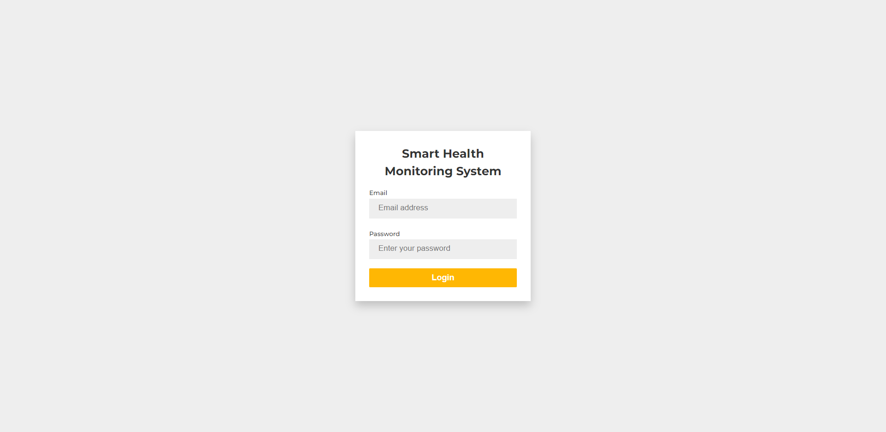
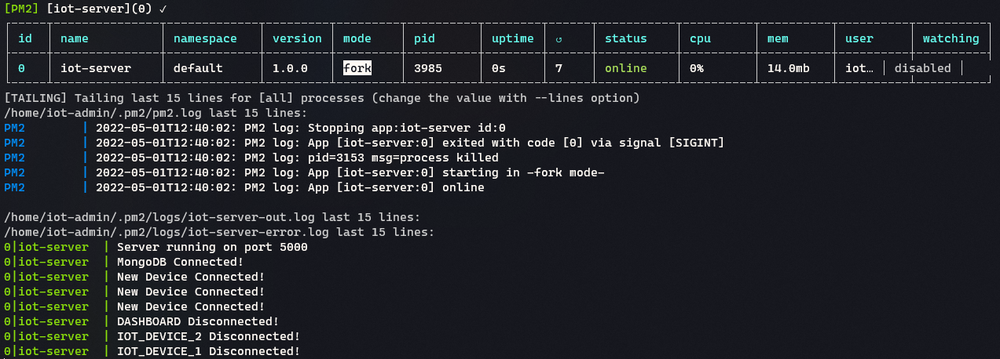

# Smart Health Monitoring System

Smart Health Monitoring System is a real-time web application made using ReactJS, NodeJS, ExpressJS, and MongoDB. The system utilizes an IoT device (Raspberry Pi) to collect vital data such as heart rate, oxygen saturation, body temperature from the patient and transmits the data to the Node server via WebSockets which is then displayed on the monitoring dashboard available to doctors and health professionals. The aim of this project is to make patient monitoring easier and more efficient, allowing for more accurate and timely diagnoses.

## Features

* Real-time monitoring of patients
* Customizable monitoring dashboard for doctors and health professionals with a user-friendly interface
* Secure login page for authorized access to patient data and monitoring dashboard
* Patient data analytics and visualization for trend analysis and forecasting
* Remote patient monitoring capabilities for home healthcare services
* Utilizes Raspberry Pi, an affordable and compact IoT device, for easy and efficient data collection and transmission.

## Technologies Used

* ReactJS
* NodeJS
* ExpressJS
* MongoDB
* WebSockets
* Raspberry Pi
* Python (used in raspberry pi to collect and transmit sensor data)

## Screenshots


*Figure 1: Login Page*


*Figure 2: Monitoring Dashboard*


*Figure 3: IoT Device Setup*


*Figure 4: Server PM2 Overview*

## Installation & Testing

1. Clone the repository
```
git clone https://github.com/username/smart-health-monitoring-system.git
```

2. Navigate to the project directory
```
cd smart-health-monitoring-system
```

3. Navigate to dashboard directory, install the dependencies & start the frontend
```
cd dashboard && npm install && npm start
```

4. Navigate to server directory, install the dependencies & start the backend
```
cd ../server && npm install && npm start
```

5. For testing purposes you can run the `mockSensor.js` script to feed data into the system
```
cd ../iot-device && node mockSensor.js
```

